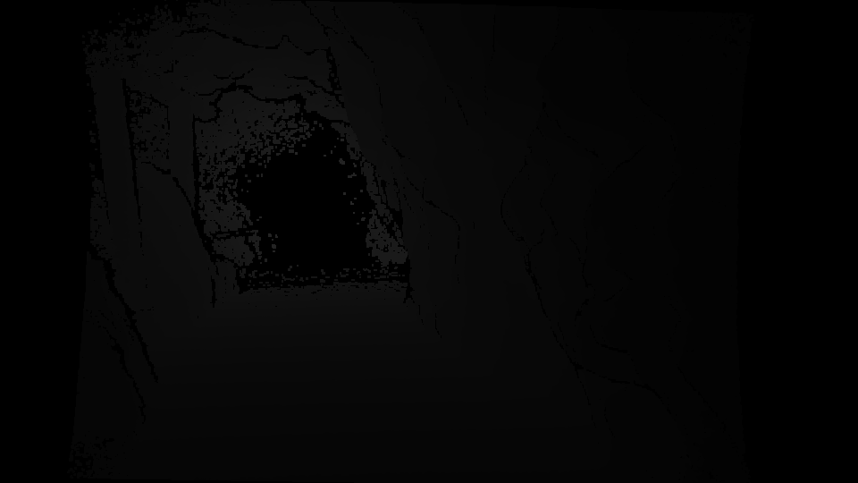
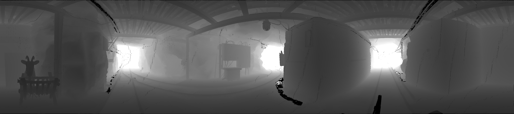
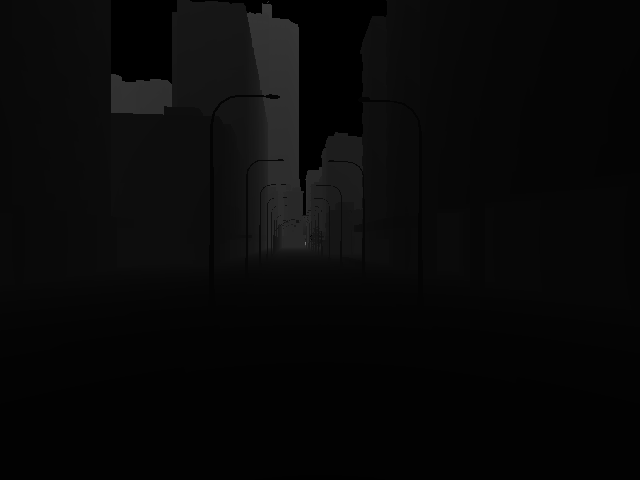

# Converting Depth Images and Point Clouds for Feature-based Pose Estimation - Examples

Here, we offer the necessary tools and example images to help you convert depth images into Flexion or Bearing Angle images on your own.

## How to Get Started

Begin by executing the following command:

```bash
./1_setup.bash
```
This script will automatically download the required binaries that where compiled with the provided [Docker image](https://github.com/rlsch/depth-flexion-conversion/blob/main/docker/ubuntu-2004/Dockerfile). Once that's done, **you can dive into the datasets and follow the instructions provided in the _local_ README files**.

## Datasets 

### Blender


Range images of a synthetic scene featuring a cylinder, a cube-like structure, a sphere, and a monkey head.

## Kinect


These depth images were captured using a Microsoft Kinect v2 in an underground mine.

### Laser scan


This range image comes from a dense terrestrial laser scan conducted in an underground mine.

### Zhang Dataset



These depth images are sourced from the "Multi-FoV" synthetic dataset created by 

Z. Zhang, H. Rebecq, C. Forster, and D. Scaramuzza, "Benefit of large field-of-view cameras for visual odometry," in 2016 IEEE International Conference on Robotics and Automation (ICRA), 2016.